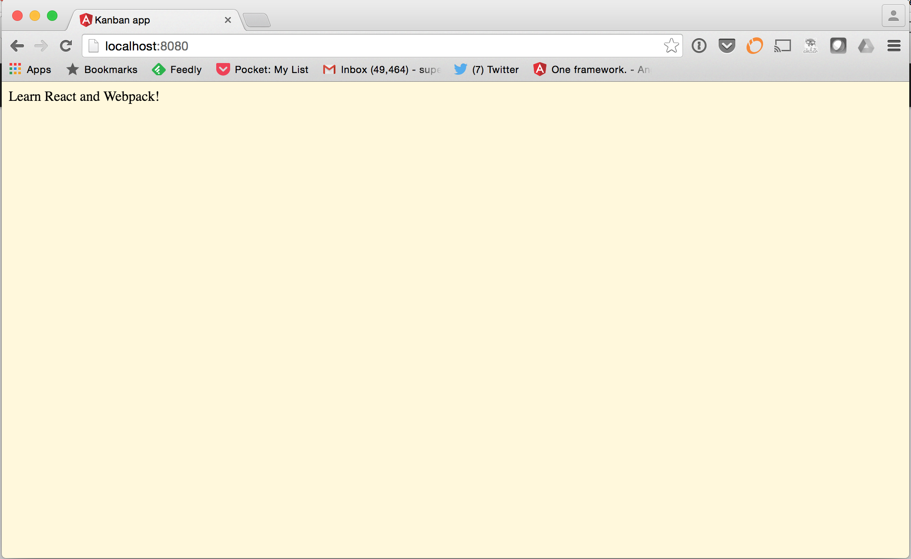

# Gaslight Apprenticeship Challenge

Welcome to the Gaslight Apprenticeship challenge. Your mission, should you choose to accept
it, is to build a shopping list application using React. This repo is based on [this excellent React book and tutorial](http://survivejs.com/webpack_react/introduction/). It should have everything you need to build a basic React application. We highly encourage you, if you are new
to React (which is fine, I am too!) to follow this tutorial and build the example application.

## Getting started

To start, you should make a fork of this repo. As long as you have node and npm installed on your computer, you should be able to do the following:

```
npm install
npm run start
```

This should build all the code in the application and start a server listening on port 8080. If you open your browser to http://localhost:8080 you should see this:



This will mean your environment is set up correctly and you are ready to start coding!

## The Shopping List

We'd like you to build a basic shopping list application. It should have the following features:

1. **Create a shopping list.**
A shopping list should have a name and list of items.
2. **Edit a shopping list.** A user should be able to change the name of their shopping list.
3. **Add a shopping list item** A user should be able to add items to a shopping list. Each item should have a name, SKU #, and price.
4. **Removing an item** A user should be able to remove an item from a list.

## Criteria

Impress us! We value code that is simple and easy to understand, as well as an application that works. We don't have any expectations that you have a server portion to this application, but if you're able to get these features implemented and want to stretch yourself/impress us more, here are some things you could try:

### Test your code
If testing isn't something you've seen much of yet, it's one of the first things we'll focus on during your apprenticeship. There's a section in the tutorial we refer to on Testing React. Looking this over and applying it would definitely make you stand out from a crowded field :)

### Store the shopping list
There are options like [Firebase](https://www.firebase.com/docs/web/libraries/react/) that would allow you to persist the shopping list in the cloud. That might be fun!

### Add features
Think of other things a shopping list might need to be it more useful.

## Submitting the finished application

Once you've built your application, submit a pull request to us. If you are new to using git there are [many](https://try.github.io/) [online](https://git-scm.com/documentation) [resources](http://gitimmersion.com/) for learning git. It will be necessary to have some basic working knowledge of git to complete this challenge, and it is a core skill you'll be using as an apprentice (and as a developer).

## Timeframe

**This part is important: I'll be reviewing these starting on Monday, April 4.**

We will review and select candidates to do pairing sessions with me on adding a feature to this application either in person or remotely using [join.me](https://www.join.me/) or something similar. We appreciate you taking the time to complete this challenge. Our commitment to you is that if you submit a pull request, it will get a thorough review and we'll give you specific feedback even if you are not selected to pair with us.

## Help, I'm stuck.

We understand that as an apprentice developer, you're new to development. That's ok, in fact, it's more than ok, it's the whole point! If you get stuck along the way, reach out. I'll be checking email regularly. I've set aside a few times to help you either in person at our office or on the phone, on this Friday, March 25. Here's where to [book a time.](https://gaslight-apprenticeship.youcanbook.me/)
